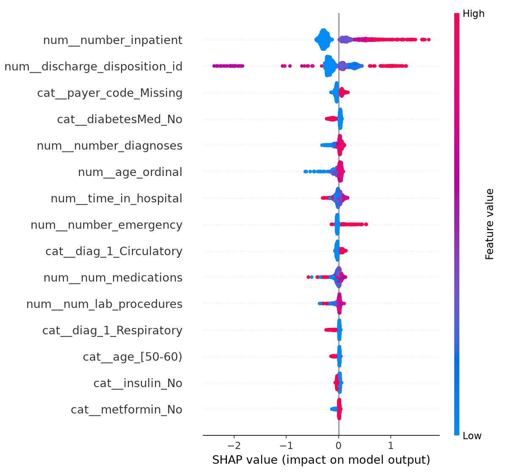
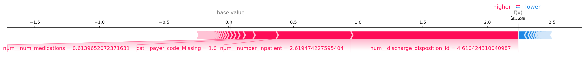

# 30-Day Hospital Readmission Risk — Explainable & Fairness-Audited

Predicts which patients are at high risk of being readmitted within 30 days of hospital discharge, with a per-patient explanation a clinician can actually interrogate, and an audited/corrected fairness gap across patient demographics.

**Why this matters:** U.S. hospitals are financially penalized under Medicare's Hospital Readmissions Reduction Program for excess 30-day readmissions. A model that flags high-risk patients *before* discharge lets staff arrange follow-up care — but only if clinicians trust it enough to act on it, and only if it doesn't quietly under-serve some group of patients.

Trained on the real **UCI Diabetes 130-US Hospitals (1999–2008)** dataset — 101,766 de-identified hospital encounters, no synthetic data.

---

## The four things this project actually found

This isn't "I trained a model and it worked" — every stage surfaced a real problem, which got diagnosed and either fixed or honestly reported.

### 1. Patient-level data leakage (caught before it inflated anything)
23% of patients in this dataset have more than one hospital encounter. A naive random train/test split lets the same patient appear in both — leaking information and inflating reported performance, a well-documented trap specific to this dataset. Fixed with a `GroupShuffleSplit` keyed on `patient_nbr`, verified to produce **zero patient overlap** between train and test.

### 2. Model overfitting, caught by SHAP — not by metrics
The first trained model's top global SHAP feature was `medical_specialty=Otolaryngology` — a category with **99 patients out of 81,613** (0.1% of training data) — outranking `number_inpatient` (prior hospitalizations), an established real predictor in the clinical literature on this dataset. A rare category with that little data is a classic overfitting tell, not a clinical signal. Fixed by consolidating any categorical level with fewer than 500 training examples into `Other`, plus tighter XGBoost regularization. Performance **held steady or improved slightly** after removing the noise — confirming it really was noise.

### 3. A fairness gap in age, correctly diagnosed
Auditing recall (did the model catch actual readmissions?), precision, and selection rate across race, gender, and age:
- **Race:** no meaningful gap between the two adequately-sized groups (Caucasian, n=15,089; AfricanAmerican, n=3,847) — recall within 1.2 points of each other.
- **Gender:** no meaningful gap (<2 points on every metric).
- **Age:** the 0–30 group had markedly lower recall (26.7% vs. 38–42% for other age groups) under one global risk threshold.

The important nuance: **AUROC for the 0–30 group was actually the *highest* of any age group (0.706)** — the model ranks young patients' relative risk just fine. The real cause: age is such a strong predictor that young patients' *absolute* risk scores run lower across the board, so they rarely clear a single population-wide threshold even when high-risk *for their age bracket*. That's a threshold-calibration problem, not a biased-training-data problem — and it has a different fix than retraining.

### 4. Fixed with a citable method, and the fix was verified to be nearly free
Applied per-age-group threshold calibration (Hardt, Price & Srebro 2016-style "equality of opportunity" post-processing) so each age group hits the same target recall.

| Metric | Before | After |
|---|---|---|
| Recall gap across age groups | 0.152 | **0.067** (−56%) |
| Overall precision | 0.213 | 0.212 (essentially unchanged) |
| Total patients flagged | 4,030 | 4,061 (+0.8%) |

Closing the gap cost almost nothing overall — because the under-served group was small, equalizing its recall didn't require meaningfully sacrificing precision elsewhere.

---

## Results

Predicting the CMS-penalized outcome (`readmitted == '<30 days'`, 11.2% prevalence — accuracy is a meaningless metric here; a model that predicts "never readmits" for everyone scores 89% accuracy and is clinically useless):

| Model | AUROC | PR-AUC | Precision @ top-20%-risk | Recall @ top-20%-risk |
|---|---|---|---|---|
| Logistic Regression (baseline) | 0.639 | 0.184 | 0.185 | 0.347 |
| **XGBoost (tuned)** | **0.673** | **0.210** | **0.213** | **0.399** |

**The clinically meaningful number:** flagging only the highest-risk 20% of patients catches **40% of all actual 30-day readmissions** — nearly 2× better than random targeting. AUROC ~0.67 is consistent with published literature on this exact dataset (real clinical tabular data is messy; a suspiciously high AUROC here would have been the red flag, not this).

### What actually drives predicted risk (global SHAP importance)

Top predictors, after fixing the rare-category overfitting: **prior inpatient visits, discharge disposition, number of diagnoses, age, and length of stay** — all established predictors in the readmission literature (Strack et al. 2014, the paper this dataset originates from).



### Per-patient explanation (what a clinician would actually see)



---

## Interactive demo

A Streamlit app lets you pick any patient, see their risk score, get a plain-language SHAP explanation, and toggle the before/after fairness fix.

```bash
git clone <this-repo>
cd healthcare-readmission-risk
python3 -m venv .venv && source .venv/bin/activate
pip install -r requirements.txt

# Get the data (real UCI dataset, ~19MB, not committed to this repo)
mkdir -p data && cd data
curl -o diabetes.zip "https://archive.ics.uci.edu/static/public/296/diabetes+130-us+hospitals+for+years+1999-2008.zip"
unzip diabetes.zip
cd ..

# Run the pipeline
cd src
python3 data_prep.py        # clean + patient-level split
python3 train_model.py      # train LogReg + XGBoost
python3 explain.py          # SHAP global + local
python3 fairness_audit.py   # bias audit across race/gender/age
python3 fairness_mitigation.py   # calibrate + verify the age fix

# Launch the demo
streamlit run app.py
```

**Note (macOS):** XGBoost needs the OpenMP runtime: `brew install libomp` if you hit a `libomp.dylib` load error.

---

## Project structure

```
src/
  data_prep.py            # cleaning, ICD-9 grouping, patient-level split, rare-category consolidation
  train_model.py           # LogReg baseline + tuned XGBoost, clinically-framed evaluation
  explain.py                # SHAP global + per-patient explanations
  fairness_audit.py         # recall/precision/selection-rate parity across race, gender, age
  fairness_mitigation.py    # per-group threshold calibration (Hardt et al. 2016), before/after verification
  id_mappings.py             # decodes numeric admission/discharge ID codes to readable labels
  app.py                       # Streamlit demo
results/                       # SHAP plots, fairness audit CSVs, trained model artifacts
data/                           # raw + processed data (not committed — see setup above)
```

## Methodology notes / honest limitations

- **This is a portfolio demonstration, not a validated clinical tool.** Any real deployment would need prospective validation, clinical oversight, and a much more rigorous fairness/safety review than what's here.
- The `race=Missing` and `race=Asian` fairness groups are too small (n=410 and n=125) to draw reliable conclusions from — flagged as low-confidence in the audit rather than silently reported alongside the reliable groups.
- The 0–30 age group's post-fix recall (46.7%) slightly overshoots its 39.9% target — a real artifact of only having 30 true positives in that group, not a bug: achievable recall values jump in ~3.3% increments at that sample size.
- The threshold-calibration fix optimizes recall parity without a hard cap on total interventions. A hospital with a fixed intervention-capacity budget would need to jointly re-optimize group thresholds against that constraint — noted as a next step, not implemented here.
- ICD-9 diagnosis codes are grouped into 9 broad clinical categories (following the original dataset paper) rather than used at full granularity, trading some predictive detail for interpretability and reduced overfitting risk.

## Tech stack

Python · pandas · scikit-learn · XGBoost · SHAP · Streamlit

## Data source

Strack, B., DeShazo, J.P., Gennings, C., et al. (2014). *Impact of HbA1c Measurement on Hospital Readmission Rates.* [UCI Machine Learning Repository](https://archive.ics.uci.edu/dataset/296/diabetes+130-us+hospitals+for+years+1999-2008).
